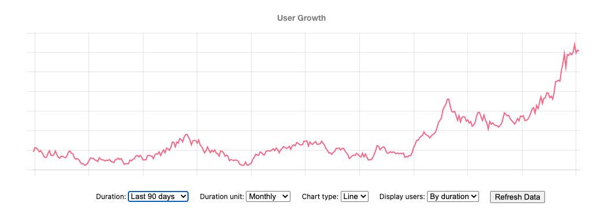

# Firebase User Growth Graph

Generate a user growth graph from your firebase account.



## Install

1. Clone and unzip the project to your local machine
2. Install dependencies from the project's root directory (run `npm install` or `yarn`)
3. Create a Firebase Service Account, then add them to `config.json` (as below)
4. Start the server (run `yarn dev` or `npm run dev`), then visit `http://localhost:8080` to see the result

### Create Firebase Service Account

To create a Firebase Service Account ([learn more](https://firebase.google.com/docs/admin/setup#initialize-sdk)):
1. In the Firebase console, open __Settings > Service Account__
2. Click __Generate New Private Key__, then confirm by clicking __Generate Key__.
3. Create a `config.json` at the root directory, then copy credential data as the following format 

```json
// config.json
{
    "credential": {
        // ...service account content
        // For example:
        // "type": "service_account",
        // "project_id": "xxx",
        // "private_key_id": "xxx",
        // "private_key": "xxx",
        // "client_email": "xxx",
        // "client_id": "xxx",
        // "auth_uri": "xxx",
        // "token_uri": "xxx",
        // "auth_provider_x509_cert_url": "xxx",
        // "client_x509_cert_url": "xxx",
    },
    "databaseURL": "https://xxx.firebaseio.com"
}
```

# License

MIT